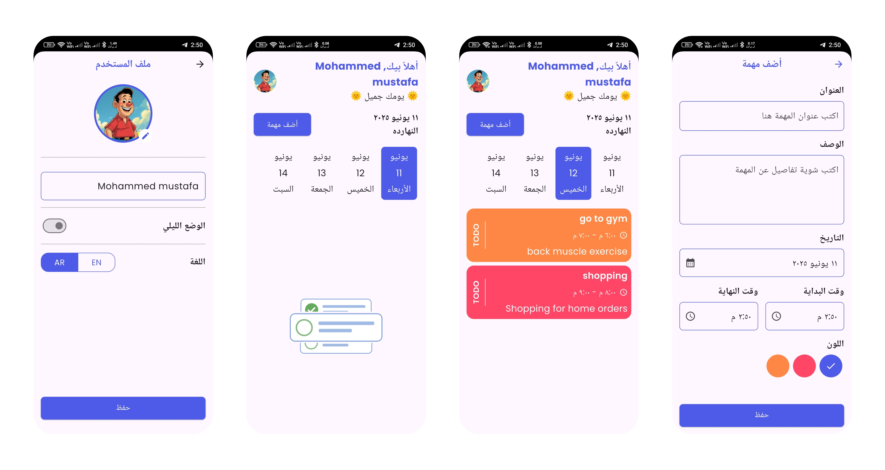
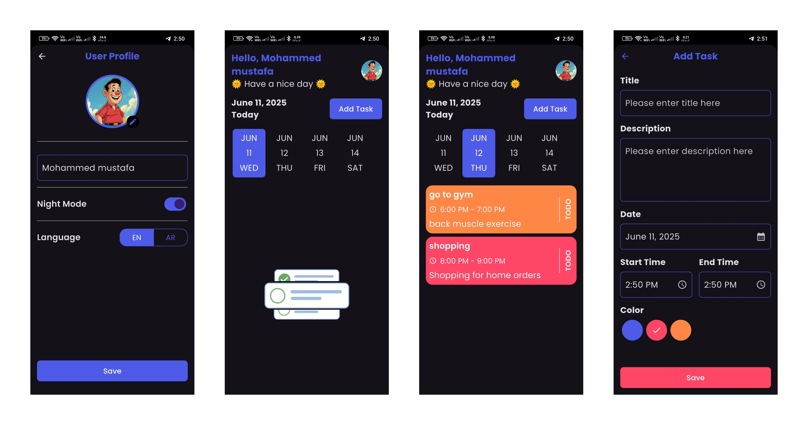

#  Taskati - Task Management App

**Taskati** is a simple and beautiful task management app built with Flutter. It helps users organize their daily tasks with an intuitive UI, theme support, local notifications, and Arabic language support.


---

## 🚀 Features

- 📅 Add, update, and delete tasks easily
- ⏰ Local notifications for:
  - Task start time
  - Task end time
  - User can enable or disable notifications manually
- 🌙 Light and Dark themes 
- 🌐 Arabic and English language support
- 💾 Caching Tasks using [Hive](https://pub.dev/packages/hive)
- 🧠 Smart and colorful task UI
- 🔒 Simple profile setup (name + image)

---

## 🛠️ Tech Stack

- **Flutter**
- **Hive** for local storage
- **flutter_local_notifications** for scheduling reminders
- **Intl** for localization (Arabic & English)
- Clean and structured code 

---

## 📸 Screenshots

| Light Mode | Dark Mode |
|------------|-----------|
|  |  |

---

## 🧪 Getting Started

1. **Clone the repository**
   ```bash
   git clone https://github.com/mohammed-mustafa1/taskati.git
   cd taskati
